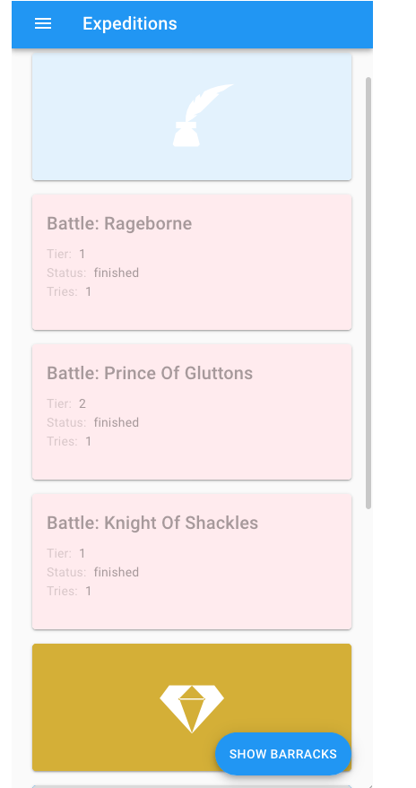

# Custom expeditions

Custom expeditions are a new AER 3.0 feature that allows the import of expedition JSON configurations. These configurations make it possible to define the content of an expedition, including:

- narrative sections with multiple outcomes
- battle sections
- reward sections

We call these sections **Branches** and these allow you to create "choose your own adventure"-like experiences.

To get a better idea of how the configuration works, have a look at our
[example file](./Example)

> **NOTE:** We might add a GUI-editor in the future to make the creation of custom Expeditions easier!
